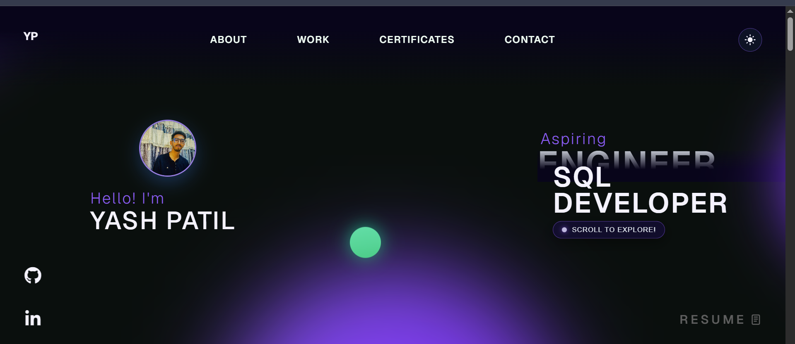
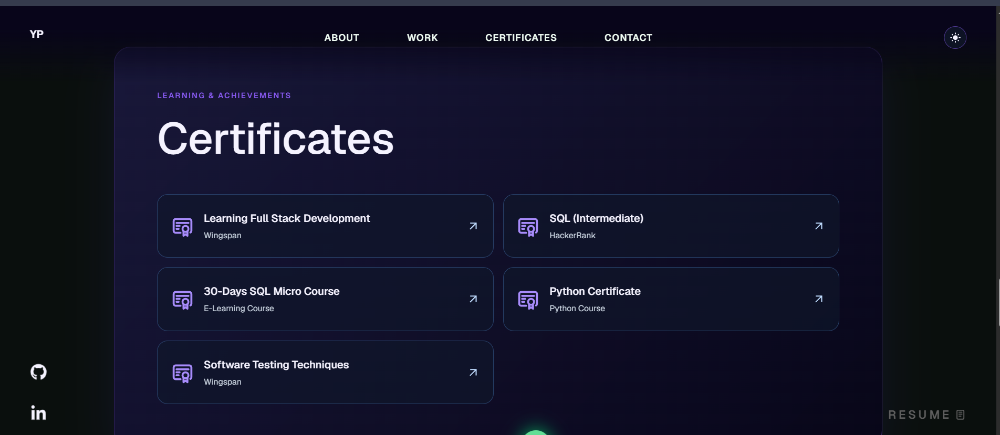
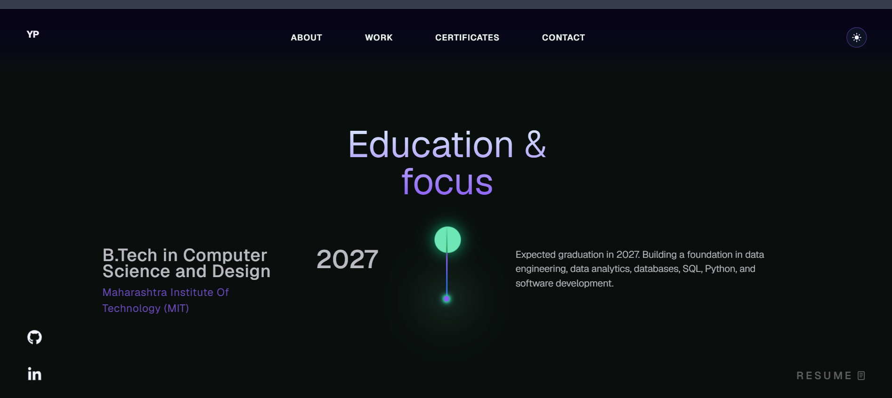
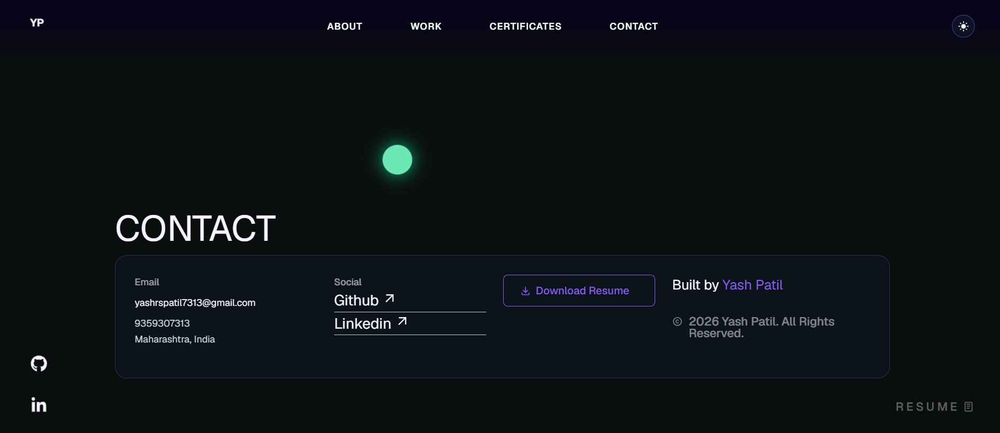

# 🌐 Yash Patil - Personal Portfolio Website

A modern and responsive portfolio website built to showcase my skills, projects, certifications, education, and professional journey as an aspiring SQL Developer and Data Engineer.

## 🚀 Overview

This portfolio serves as my digital presence, providing recruiters, developers, and professionals with an overview of my technical skills, academic background, certifications, and project experience.

The website features a modern dark-themed user interface with smooth navigation, interactive sections, and responsive design for both desktop and mobile devices.

## ✨ Features

- Modern Dark UI Design
- Fully Responsive Layout
- Professional Landing Page
- About Me Section
- Education Timeline
- Project Showcase
- Certifications Section
- Resume Download
- GitHub & LinkedIn Integration
- Contact Information
- Light/Dark Theme Toggle

## 🛠️ Tech Stack

- React.js
- JavaScript
- HTML5
- CSS3
- Tailwind CSS
- Git
- GitHub

## 📸 Screenshots

### Home Page

### Education Section

### Certificates Section

### Contact Section

## 🎓 Education 

**Bachelor of Technology (B.Tech)**  
Computer Science and Design

**Maharashtra Institute of Technology (MIT)**

Expected Graduation: **2027**

## 📂 Featured Projects

### 🤖 AI Resume Analyzer

An AI-powered application that analyzes resumes, calculates ATS compatibility scores, extracts technical skills, identifies skill gaps, and provides improvement suggestions.

**Technologies Used:**
- Python
- PostgreSQL
- React
- FastAPI
- NLP

---

### 📊 Retail Sales Analysis using SQL

A SQL-based business analysis project focused on data cleaning, querying, and generating insights from retail sales datasets.

**Technologies Used:**
- SQL
- MySQL

## 🏆 Certifications

- SQL (Intermediate) – HackerRank
- Python Certificate
- 30-Days SQL Micro Course
- Software Testing Techniques
- Full Stack Development Learning Program

## 🎯 Career Objective

I am passionate about Data Engineering, Database Management, SQL, Python, and Analytics. My goal is to build scalable data-driven solutions and develop expertise in modern data technologies while continuously learning and improving my technical skills.

## 📬 Contact

📧 Email: yashrspatil7313@gmail.com

📍 Maharashtra, India

## 🔗 Connect With Me

- GitHub: https://github.com/yashpatil7313
- LinkedIn: Add Your LinkedIn Profile Link

## 🌍 Live Demo

Add your deployed portfolio link here.

---

⭐ If you found this project interesting, feel free to star the repository.
